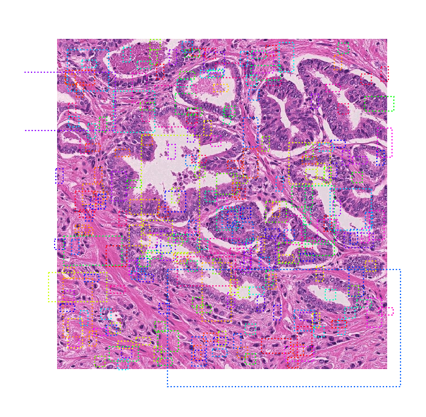

# Path R-CNN: Object Detection and Segmentation on Pathology Image

This project is forked from [Matterport](https://github.com/matterport/Mask_RCNN) and modified 
to work on pathological images. As it inspired by Mask R-CNN, we name our model Path R-CNN.

<p align="center"> 
    
</p>

## Model Architecture

We use the ResNet model as a backbone to extract feature maps from the input image. Extracted feature maps 
are then fed into two branches. In the left branch, the region proposal network (RPN) first generates 
proposals to tell which regions the grading network head (GNH) should focus upon. The GNH is then used to 
assign Gleason grades to epithelial cell areas. In the right branch, an Epithelial Network Head (ENH) is 
used to determine if there is epithelial tissue in the image. The final output depends on the results of 
the ENH. If there is no epithelial cells, the model outputs the whole image as stroma. Otherwise the model 
outputs its results from the GNH. As you can see the left part of our model is a "Mask R-CNN". While we use
an ResNet, padded with a small network head ENH to train the right part (see below: two stage training 
procedure).

## Two stage training procedure
We developed a two-stage training strategy for our model:

* __Stage 1__ train the GNH along with the higher layers (stage 4 and 5 in 101 layer structure)
 of the ResNet backbone. We used the MS COCO pre-trained model to initialize the network. The network 
 was optimized using stochastic gradient descent (SGD) with backpropagation. Adopting a backward 
 fine-tuning strategy, we first trained the GNH for 25 epochs. Then we fine-tuned the ResNet 
 upper layers along with the network head.

* __Stage 2__ takes the fixed weights trained in Stage 1 and only trains the ENH. We chose to 
  fix the Stage 1 weights in this step because of our intuition that epithelial cell detection is a 
  relatively simple task. We empirically found that this method worked very well in practice.

## Details of this Repo

The repository includes four folders:
* [Data_Pre_Processing](/Data_Pre_Processing) contains source code for pre processing prostate dataset. Some
of the important functions and their corresponding files are:
    * Remove instance that are two small. ```instance_mask_mode.py```
    * Convert Semantic mask to instance mask using union-find algorithm. ```semantic_2_instance.py```
    * Prostate dataset object. ```prostate_dataset.py```
 
* [Mask_RCNN](/Mask_RCNN) contains source code for building up the left branch of our model. Some of the important
folders and files are:
    * Source code for model config and Prostate dataset generator ```prostate.py```
    * Source code of Path R-CNN built on FPN and ResNet101 (left branch). ```model.py```
    * Training code for Prostate Pathological data. ```Training Folder```
    * Evaluation on mIOU ```Evaluation Folder```
    * Detection results on Prostate Dataset ```Inference Folder```

* [ResNet](/Mask_RCNN) contains source code for building up the right branch of our model. Some of the important
folders and files are:
    * Source code for train the right branch. ```train_prostate_resnet_for_each_fold.py```
    * Source code for combine two branch trained weights. ```h5file_manipulation.ipynb```
    * Source code for plot roc and derive auc. ```derive_AUC.py plot_roc_curve.ipynb```

* [CRF_Post_Processing](/CRF_Post_Processing) contains conditional random field post precessing part discussed 
[here](https://github.com/lucasb-eyer/pydensecrf).
    * The effect of using CRF is shown in ```CRF_Post_Processing.ipynb```.

## Visualization

Here are some visualization results using the left branch of our model.

### 1. Anchor sorting and filtering

Visualizes every step of the first stage Region Proposal Network and displays positive anchors 
along with anchor box refinement.

<p align="center"> 
    
</p>

### 2. Bounding Box Refinement
This is an example of final detection boxes (dotted lines) and the refinement applied to them (solid lines)
in the second stage.

<p align="center"> 
    
</p>


### 3. Mask Generation
Examples of generated masks. These then get scaled and placed on the image in the right location.

<p align="center"> 
    
</p>

### 4.Layer activations
Often it's useful to inspect the activations at different layers to look for signs of trouble 
(all zeros or random noise).

<p align="center"> 
    
</p>

### 5. Composing the different pieces into a final semantic result

<p align="center"> 
    
</p>

### More Prediction Results

<p align="center"> 
    
    
</p>

##### Useful Paper:

[Mask R-CNN](https://arxiv.org/abs/1703.06870)

[Efficient Inference in Fully Connected CRFs with Gaussian Edge Potentials](http://web.archive.org/web/20161023180357/http://www.philkr.net/home/densecrf)